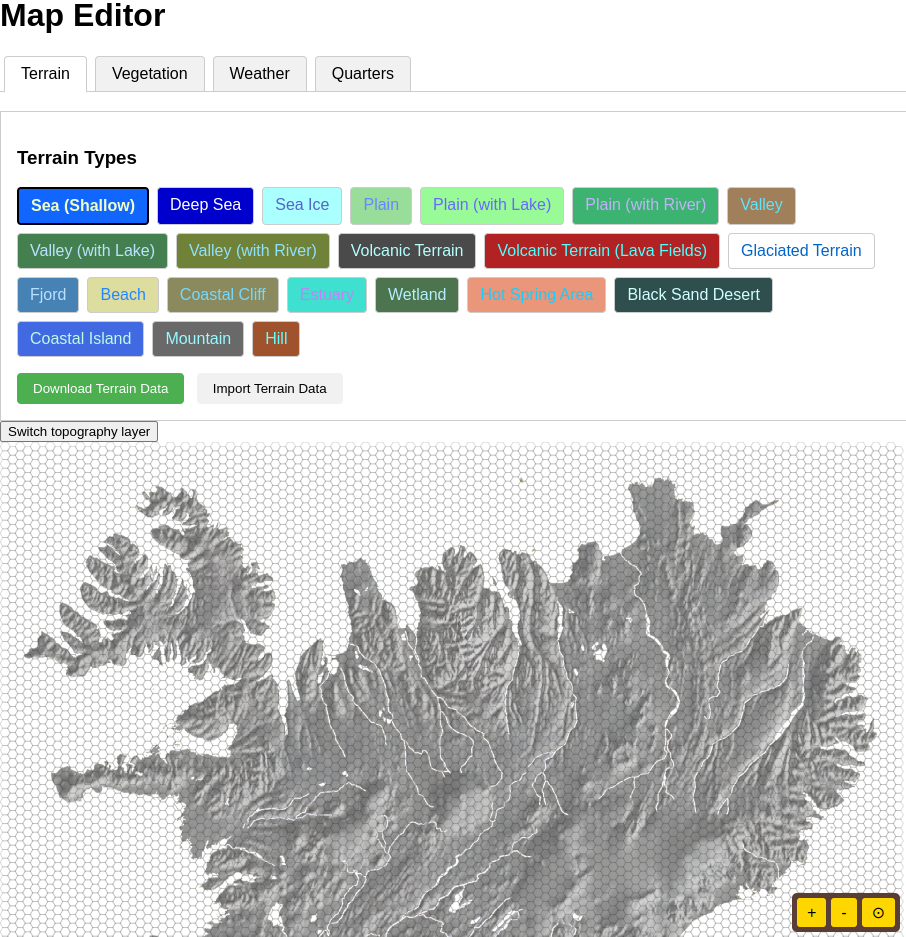

This week, we're excited to share some insights into a crucial tool we've developed behind the scenes: a basic map editor for Goði Sagas: Ísland. This internal tool is designed to significantly speed up our development process as we build the world of Ísland.

One of the key aspects of Goði Sagas is its strategic map, and to iterate on its design quickly, we needed a way to easily create and modify it. Our basic map editor allows us to "paint" different types of terrain directly onto the 2D hexagonal grid. This means we can rapidly experiment with the layout of icy fjords, volcanic wastelands, forests, and other terrain features, instantly seeing how they come together.

Beyond terrain, the editor also lets us layer in different types of vegetation across the map. This allows us to visualize how plant life is distributed and how it interacts with the underlying terrain, which is important for both visual clarity and strategic considerations.

We've also integrated the ability to test weather tiles directly on the map. This helps us understand how different weather conditions might look and potentially affect gameplay in various regions of Ísland.

Finally, we tested how to render some units in the map.

Throughout the development of this editor, we've prioritized good performance, responsiveness, and broad browser compatibility. This ensures that our team can work efficiently, regardless of their setup. While it's not a visually complex tool, its functionality allows us to rapidly create, test, and refine the strategic landscape of Goði Sagas: Ísland, ultimately leading to a richer and more engaging game for you.

