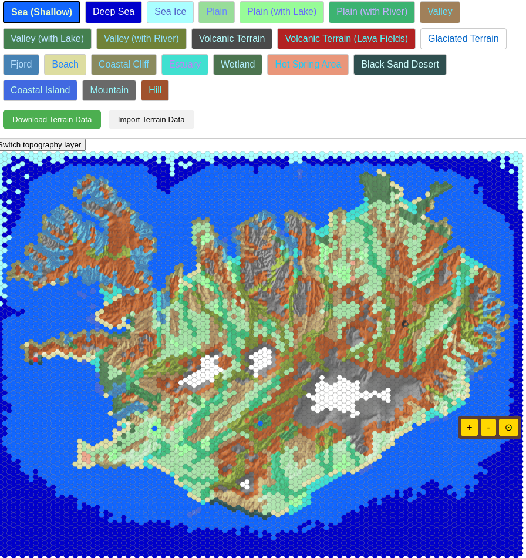
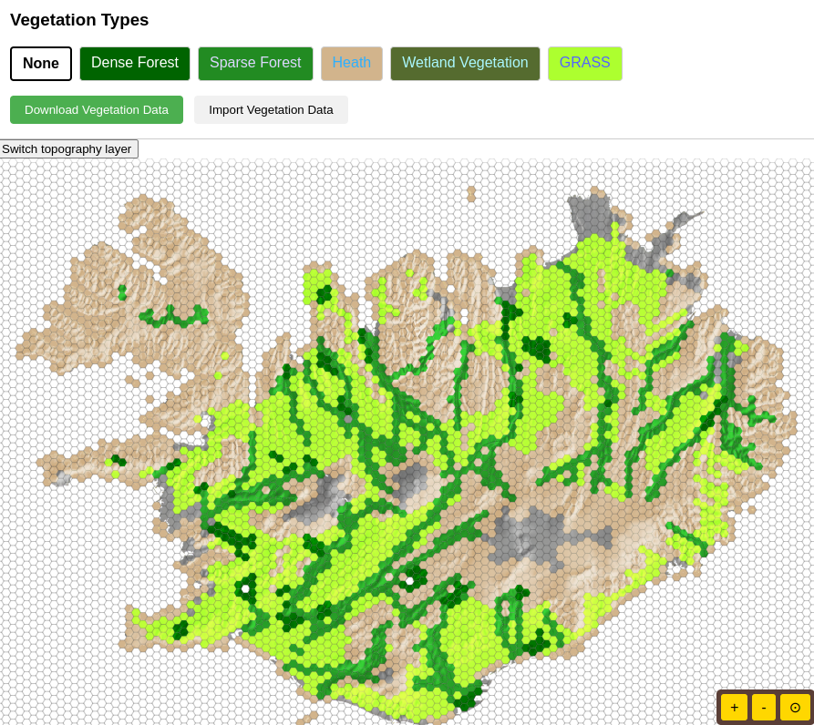

This week, we're diving into the design of the game map for Goði Sagas: Ísland. Our focus is on creating a clear and strategically rich representation of medieval Iceland using a 2D hexagonal tile system within your browser.

We've dedicated significant effort to accurately mapping the diverse terrain of Ísland. You'll see distinct hexagonal tiles and layers representing terrain types and vegation types. Each terrain type is crucial, directly influencing how your units can move, their effectiveness in combat, and the availability of different resources.

The distribution of vegetation across the map is also being carefully considered. Different types of plant life will appear in coastal regions compared to the highlands, clearly indicated on the hexagonal grid. This variation will not only add a layer of realism but also create strategic opportunities related to resources and movement.

The sea surrounding Ísland is also represented with navigable fjords, strategically important straits, and open ocean tiles. These will govern naval movement and trade routes within the game.

Our primary goal is to create a map where every hexagonal tile presents meaningful strategic choices. While the visuals will be clear and functional with basic colors in our 2D SVG format, the depth of the terrain and vegetation will ensure a rich and engaging strategic experience.

