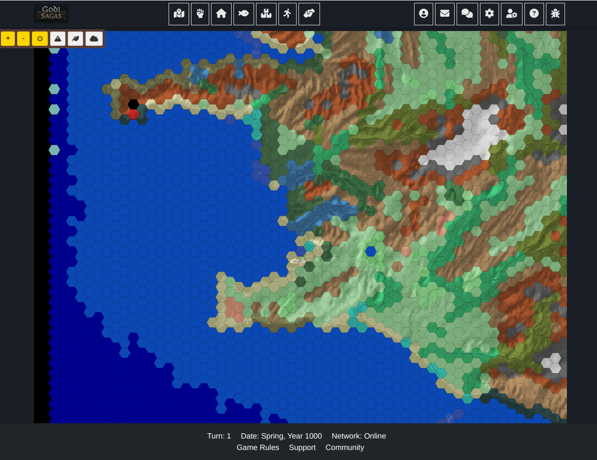

This week, we're providing an update on the initial stages of developing the user interface (UI) for Goði Sagas: Ísland. This is a very early, basic version – an MVP (Minimum Viable Product) – that is currently for internal development purposes only. It is not yet ready for any external testing.

Our primary focus has been on establishing the foundational elements that will allow us, as developers, to interact with the core systems of the game. This includes setting up the initial layout and basic functionality for key areas such as the map view, resource management, unit control, and basic menu navigation.

The goal of this development MVP UI is to create a functional framework that allows us to test the fundamental gameplay loops and make informed decisions about the best direction for further development. At this stage, ensuring the underlying systems work and provide the necessary information for us to continue building the game is the priority, not visual polish or external usability.

This initial UI serves as a base upon which more features and visual enhancements will be built in future development cycles. Its current purpose is to enable us to internally navigate and interact with the game's essential systems to guide our ongoing work.

